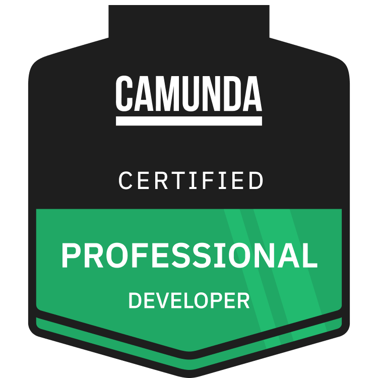
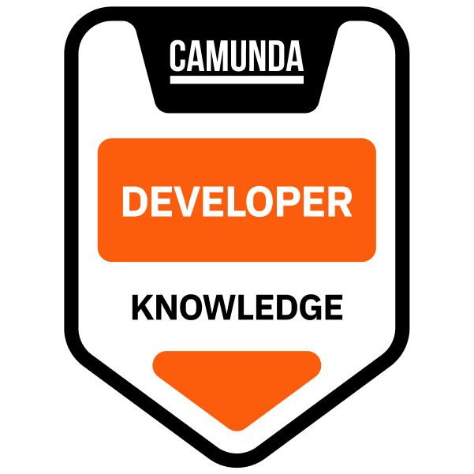
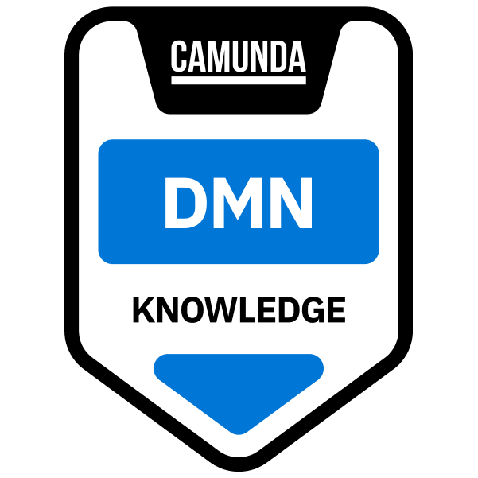
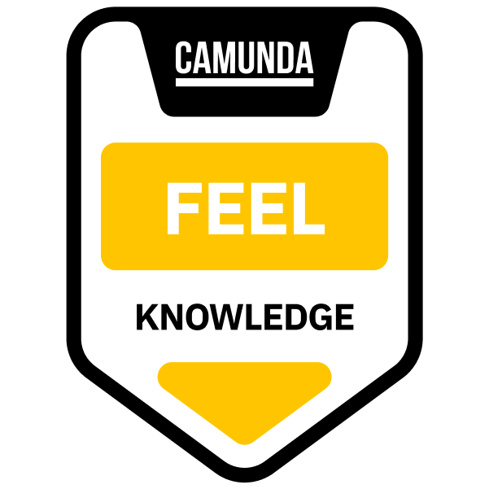

## Hi 👋, I'm Alex

Tech enthusiast and process automation advocate specializing in [Camunda BPM](https://camunda.com/). Passionate about designing efficient, scalable solutions to streamline workflows and drive business impact.

See my:
- [Linkedin](https://www.linkedin.com/in/alex-chabatar-08939591/) profile
- [Upwork](https://www.upwork.com/freelancers/~01916b901cefc80351) profile (Top Rated Talent with 100% Job Success)

I'm also Camunda <mark>Certified</mark> Professional - Developer, check it [here](https://www.credly.com/badges/7bdad436-f90d-455c-a9cd-719e3a46c7d6) to verify.

<a href="https://www.credly.com/badges/7bdad436-f90d-455c-a9cd-719e3a46c7d6">
<a href="https://www.credly.com/badges/7ea1cead-d444-4985-a74f-95abbf92f546">
<a href="https://www.credly.com/badges/3439ac3d-9b8f-43d0-b15a-6f164341ac9b">
<a href="https://www.credly.com/badges/7498c9d0-a1c9-4b3c-a901-8f76f0f65fa9">
<a href="https://www.credly.com/badges/0f7a5bef-4036-4991-ae7f-1b26fe37bc5d">

🚀 Let’s automate any process, anywhere!

<!--
**alex-chabatar/alex-chabatar** is a ✨ _special_ ✨ repository because its `README.md` (this file) appears on your GitHub profile.

Here are some ideas to get you started:

- 🔭 I’m currently working on ...
- 🌱 I’m currently learning ...
- 👯 I’m looking to collaborate on ...
- 🤔 I’m looking for help with ...
- 💬 Ask me about ...
- 📫 How to reach me: ...
- 😄 Pronouns: ...
- ⚡ Fun fact: ...
-->
